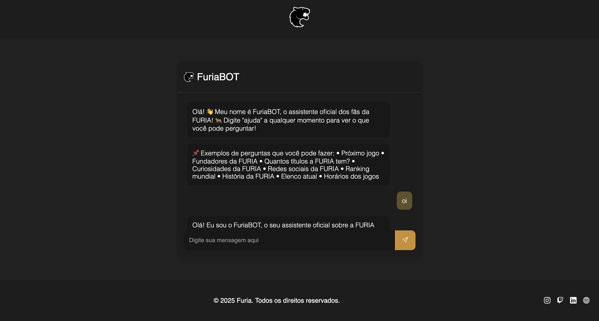

# 🐆 FuriaBOT - Assistente dos Fãs da FURIA Esports

**FuriaBOT** é um chatbot interativo e responsivo desenvolvido com **HTML**, **CSS** e **JavaScript puro**, que simula um assistente virtual para fãs da organização FURIA Esports. Ele responde perguntas sobre o time, títulos, próximos jogos, curiosidades, elenco e mais — tudo isso com uma interface temática e acessível.

> 💡 Projeto criado como desafio opcional da disciplina de Desenvolvimento Front-End, com foco em praticar lógica, manipulação de DOM e interações dinâmicas com JavaScript.

---

## 🚀 Principais Funcionalidades

✅ Interface responsiva e estilizada com a identidade visual da FURIA  
✅ Sistema de respostas automáticas baseado em palavras-chave  
✅ Mensagens dinâmicas com rolagem automática  
✅ Links interativos para redes sociais e site oficial  
✅ Animação no logo da FURIA ao passar o mouse  
✅ Acessibilidade: uso de `aria-label`, contraste adequado e navegação fluida

---

## 📸 Capturas de Tela



---

## 🛠️ Tecnologias Utilizadas

- HTML5  
- CSS3 (com variáveis, animações e responsividade)  
- JavaScript puro (manipulação de DOM, eventos e lógica de respostas)

---

## 📁 Estrutura de Pastas

```
furia-bot-project/
├── docs/
│   └── FURIAbot_Documentacao_Inicial.pdf
├── public/
│   ├── assets/
│   │   └── images/
│   │       └── furia-icon.png
│   ├── scripts/
│   │   └── main.js
│   ├── styles/
│   │   └── style.css
│   └── index.html
└── .gitignore
```

---

## 📚 Exemplos de Perguntas que o Bot Responde

- Qual o próximo jogo?  
- Quantos títulos a FURIA tem?  
- Quem são os fundadores?  
- Me fale uma curiosidade da FURIA  
- Redes sociais da FURIA  
- Elenco atual no CS  
- História da organização

---

## 🧠 Funcionalidades Futuras

🤖 **Integração com IA**  
- Conectar o chatbot a uma API de linguagem natural (ex: OpenAI, Hugging Face) para permitir respostas mais inteligentes e personalizadas.  
- Evoluir de palavras-chave para compreensão contextual.

📅 **Calendário de jogos**  
- Buscar e exibir partidas futuras em tempo real via API de esportes.

📈 **Painel de estatísticas**  
- Mostrar desempenho da FURIA em torneios e rankings com gráficos interativos.

🗂️ **Banco de dados externo**  
- Persistência de histórico de conversa e preferências do usuário.

🎨 **Personalização**  
- Temas alternativos, dark/light mode e escolha de avatars.

---

## 👨‍💻 Autor

Desenvolvido por Lucas Carvalho — estudante de tecnologia e apaixonado por esportes eletrônicos.

📧 Contato: lucascarv1804@gmail.com
🔗 [LinkedIn](https://www.linkedin.com/in/lucas-almeida-de-carvalho/)

---

## 📄 Licença

MIT License. Livre para uso e modificação, desde que com os devidos créditos.
